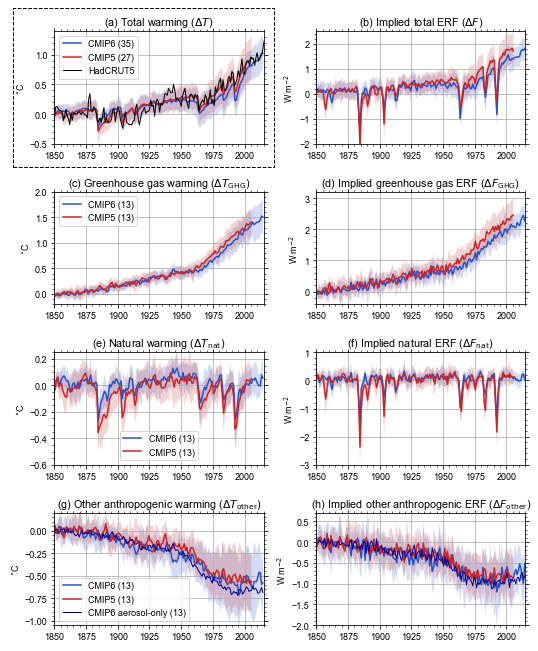

# Explaining the suppressed late-20th century warming in CMIP6 models.
In the ensemble mean, CMIP6 models show less warming than CMIP5 models and observations between about 1960 and 2000 (subplot a). We determine that this is due to a lesser "implied" historical effective radiative forcing in CMIP6 models than in CMIP5 (subplot b). Digging further into the causes reveals that greenhouse-gas related warming is slightly less (subplot c) and implied forcing is substantially less in CMIP6 (subplot d). The bigger difference in the GHG forcing compared to the GHG-induced warming is due to CMIP6 models having overall higher climate sensitivity than CMIP5 models; some of the large difference in forcing is made up for by increased sensitivity. We also see that other anthropogenic (mostly aerosol) cooling is greater in CMIP6 (subplot g), resulting from a slightly stronger forcing (subplot h) augmented by the increase in climate sensitivity going from CMIP5 to CMIP6. We verify the implied ERF method using RFMIP experiments from 8 CMIP6 models, showing a good correspondence.

## Paper
Currently in review.

## Installation / repo setup

1. `git clone git@github.com:chrisroadmap/cmip5-cmip6-forcing.git`
2. `cd cmip5-cmip6-forcing`
3. `conda env create -f environment.yml`
4. `conda activate cmip5-cmip6-forcing`
5. `nbstripout --install`

## Reproducing results
The `notebooks` directory produces the figures and results in the paper.

## Acknowledgements
1. The file `data_input/cmip56_forcing_feedback_ecs.json` is used directly from [v1.9 of Mark Zelinka's GitHub repository](https://github.com/mzelinka/cmip56_forcing_feedback_ecs). See also [Zelinka et al. (2020)](https://doi.org/10.1029/2019GL085782).
2. We thank the UK Met Office for making available the HadCRUT5 global mean surface temperature dataset, available from https://www.metoffice.gov.uk/hadobs/hadcrut5/data/current/download.html.
